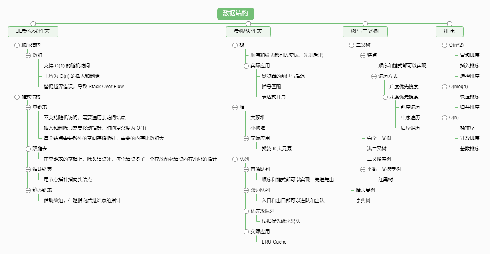
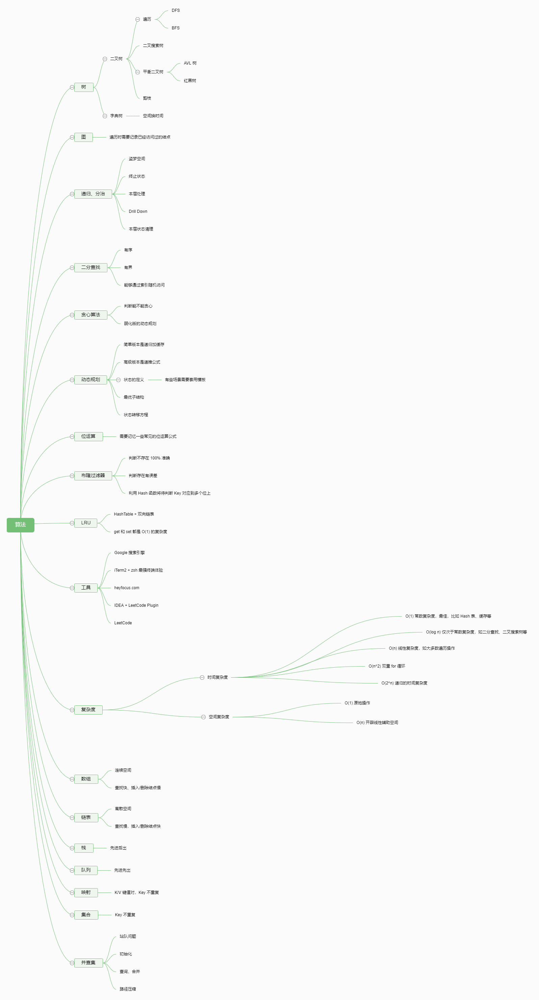

# woodwhales-algorithm
数据结构与算法学习

### 数据结构

参见：[数据结构](doc/数据结构.md)

### 算法脑图

参见：[算法](doc/算法.md)

### 练习技巧

#### 切题四件套

在写任何一个题目、面试答一个题目之前，先养成四步系统化的思考题目的方式（切题四件套）：

- clarification

  多看几次题目，和面试官多沟通，确保理解题目准确。

- Possible Solutions

  非常重要！看到题目之后，想【所有可能的解法】来解题，先过一遍。

  - Compare(space/time)

    不要只用想到的第一种写法去解题，比不同的方法时间、空间复杂度的区别，从中找出最优解法

  - optimal（加强）

- Coding（多写）

- Test cases 列举测试样例。

#### 五遍刷题法

五毒神掌，任何题目都至少刷 5 遍

- 第 1 遍：（适合初次练习）
    - 5分钟：读题 + 思考（如果基础薄弱，可以给自己 10 分钟到 15 分钟时间）。
    如果在思考时间内没有任何思路，不知道怎么做的话也很正常。
    - 直接看解法
    适用于上一点中没有任何思路的情况下，有思路的话直接 Coding 就行了。
    同时注意比较多解法，比较解法优劣。
    算法的本身是要理解、运用的，而不是自己发明创造			 	

    - 背诵、默写好的解法。
    背诵和默写很重要，在背诵和默写的基础上，可以慢慢做到理解。
	
- 第 2 遍：（在第1遍的基础之上，这时候没必要看他人的解法了）
    - 马上自己写  -- > leetcode上提交，不断 Debug 修改
    - 多种解法比较、体会 --> 优化。
    比较不同解法的时间、内存消耗。
    - 对于执行时间长的Code，多想优化策略。
    - 直到所有不同解法都是优的（领先90%以上，80%也不错）。
	
- 第3遍：（在第2遍的基础之上，过了24小时之后，做前一天做过的题目）
	- 对于不同解法熟练程度不一样，针对性的对自己不是特别熟的题目进行专项练习。
	
- 第4遍：（第3遍过了一周之后，反复回来练习相同的题目，同时对于不熟练的题目进行专项练习）
	
	- 完成了第4遍，基本上对于相关知识点掌握的比较牢固了
- 第5遍 ：（针对面试，面试前一个星期、两个星期进行恢复性训练。）
	- 将之前做过的题目再做一遍
	- 时间视面试准备程度而定，按照自己的时间计划安排